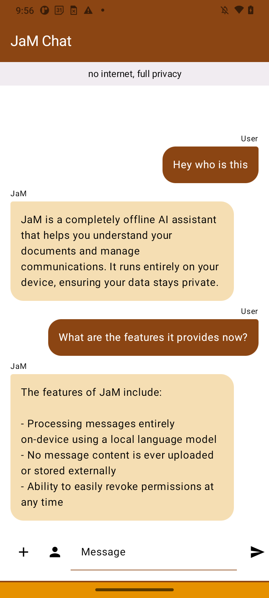
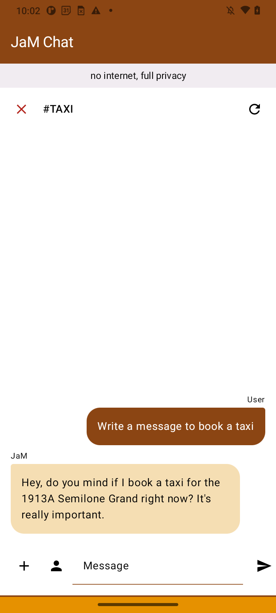

# Local LLM Inference Android

### Overview

This is a sample app that demonstrates how to use the LLM Inference API to run common text-to-text generation tasks like information retrieval, sms/email drafting, and document summarization.

This application must be run on a physical Android device to take advantage of the device GPU.

## How to Build the Demo App

### 1. Download the Code

To download the demo code, clone the git repository.

After downloading the demo code, you can import the project into Android Studio and run the app with the following instructions.

### 2. Prerequisites

*   The **[Android Studio](https://developer.android.com/studio)**
    IDE.

*   A physical Android device with a minimum OS version of SDK 24 (Android 7.0 -
    Nougat) with developer mode enabled.

### 3. Build and Run

To import and build the demo app:

1. Download [Android Studio](https://developer.android.com/studio) and install.

2. From the Android Studio, select **File > New > Import Project**.

3. If Android Studio requests a Gradle Sync, choose **OK**.

4. Build the project by selecting **Build > Make Project**.

   When the build completes, the Android Studio displays a `BUILD SUCCESSFUL` message in the Build Output status panel.

To run the demo app:

1. Ensure that your Android device is connected to your computer and developer mode is enabled.

2. From Android Studio, run the app by selecting **Run > Run 'app'**.

## How to Use the Demo App

### Standard Flow

#### 1. Select a document

The user selects a document, and ask questions from the document.

#### 2. Select a contact

The user selects a contact, and can ask to generate a new message to be sent. 

### Using Bundled Model

The language model is bundled with the app. The gradle files have model download functions to ensure necessary downloads. 

If you want to use a new local model.

1. Place your model file in the `app/src/main/assets/` directory
2. Create or edit your `local.properties` file in the project root
3. Add the following properties:
   ```
   USE_LOCAL_MODEL=true
   BUNDLED_MODEL_ASSET_NAME=your_model_filename.task
   ```
4. Build and run the app

With this configuration:
- It will automatically use the model from your app's assets
- The model will be extracted to the app's internal storage on first run
- There are a few models that can run locally in the `Models.kt`

This approach is ideal for distribution as it ensures the app works offline without any additional setup by users.

#### Note on Large Model Files

When bundling large model files (>100MB), you may encounter memory issues during the build process. The following settings have been added to improve build performance:

1. Increased Gradle JVM heap size in `gradle.properties`
2. Added optimizations to prevent compression of already compressed model files
3. Enabled parallel build execution

If you still encounter "Out of memory: Java heap space" errors, you can:
1. Further increase the memory in `gradle.properties`: `-Xmx6g` or higher
2. Split your model into smaller chunks (if possible)
3. Consider using the dynamic download approach instead for very large models

### Chat with Model

Once the model is downloaded, the user can interact with it by entering prompts and receiving responses.

## Reference
For more details, see the [LLM Inference guide for Android](https://developers.google.com/mediapipe/solutions/genai/llm_inference/android).

This project was initially created from the [samples here](https://github.com/google-ai-edge/mediapipe-samples/tree/main/examples/llm_inference/android).

## Demo

<p align="center">
  
  
</p>
